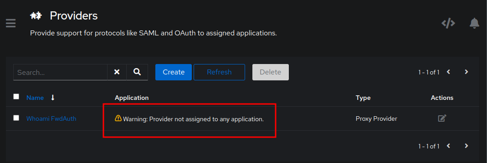

# Authentik and Traefik  

## Overview  

1. Traefik Version: 2.94
    * https://chat-us1.kefacp.com:4443/dashboard/#/
2. Authentik Version: 2022.10.1
    * https://chat-us1.kefacp.com:7443/if/admin/#/administration/overview
3. Whoami: http://chat-us1.kefacp.com:5080/

## DNS Record  
Ensure that a DNS record exists for `test-whoami.kefacp.com` as cname record pointing to chat-us1.kefacp.com

## Initial Pages
  
  

## Authentik Setup  

### Initial Setup  
With Authentik being reverse proxied through Traefik and the middleware showing as enabled in Traefik's dashboard, then configuration of Authentik can begin.  

- Navigate to Authentik at https://chat-us1.kefacp.com:7443/if/flow/initial-setup/
- Login to Authentik to begin setup.  

> **First time setup**

* If this is the first time logging in you will have to set the password for `akadmin` (default user).  
**NOTE**: If establishing the default credentials fails - the setup is not working correctly.  

After successful login to the `akadmin` user to Authentik open the `Admin Interface` clicking the button in the upper right.  

  

## Applications / Providers

This guide is built off of the 2022.07.03 update which includes the embedded outpost.  
The embedded outpost requires version `2021.8.1` or newer.  This prevents needing the seperate Forward Auth / Proxy Provider container.  

### Certificates Upload
1.  In the Admin Interface, go to System -> Certificates -> Create
    
    
2.  

### Traefik Individual Application (forwardAuth)  
An Application specific Forward Auth configuration will allow different authentication flows to be selected and not disrupt the default domain authentication flow.  For example the default domain authentication flow allows a user to authentication with Authentik using username/password only.  An application specific could be used for app with additional security ie an OTP, or local networks only, etc..  In most cases the default authentication flow will serve most homelab uses.  

---

### Provider Creation (individual application)
1.  In the Admin Interface, go to Applications -> Providers -> Create  
      

2.  Proxy Provider
      

    a.  Name: `Whoami FwdAuth`
    b.  Select: `Forward auth (single application)`  
        **Single Application is where we change it up!*  
    c.  External Host: `https://test-whoami.kefacp.com`

    
    

    After hitting Finish it will show that it's not bound to an Application:  
    

#### Application Creation (individual application)  
1.  In the Admin Interface, go to Applications -> Applications -> Create   
      

    a.  Name: `Whoami FwdAuth`
        _This is what appears on the Authentik user interface/dashboard_  
    b.  Slug: `whoami-fwdauth`  
        _An internal application name, name isn't super important_  
    c.  Provider: `Whoami FwdAuth`
        _This should match the previously created provider_  
    d.  Launch URL: `https://test-whoami.kefacp.com`
        _Do NOT put anything in the Launch URL, it needs to autodetect since it's the catch all rule_  
    e.  UI Settings (additional) - Up to you to decide on any of the remaining optional items.  

    

    After hitting Create it will show that it is now bound to the previously created provider:
    

#### Embedded Outpost (individual application)  
1.  In the Admin Interface, go to Applications -> Outposts
2.  Edit the existing embedded outpost by clicking Edit under Actions  
     

3.  **Highlight** any application you want the outpost to be able to provide for.  In this case **Highlight** `Domain Forward Auth Application`  

    

    After hitting Update the Outpost page will show that the embedded outpost now has a provider bound to it:  
    

#### Traefik Individual Application (Test / Validation)  
In order for Traefik to apply forwardAuth and require authentication to access a resource, you must tell Traefik that by adding a Middleware.  

