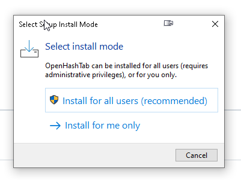

# Hash check - file verification

## 1. Download Open Hash Tab Program

* ### A. Using your browser goto the File Server and Login

> ## https://file.ziongjcc.org

* ### B. Click the menu button

* ### C. Select the Podcast Addict Link

* ### D. Download Setup File

## 2. Install Open Hash Tab Program

* ### A. Double Click on the Setup Program

* ### B. Select Install Mode - You may choose either option.

* ### C. Allow the setup program to run

* ### D. Select Installation Language

* ### E. Accept License

* ### F. Select Installation Location

* ### G. Accept Both Installation Tasks

* ### H. Start Installation

* ### I. Complete Installation

## 3. Download Audio Transcript File

* ### A. Select Transacript File

* ### B. Open Download Folder

* ### C. Right Click on File to show Properties

* ### D. Select Hash Tab in Property Dialog

* ### E. Return to File Server and Select the Hash List in File

* ### F. Find the hash for the file you want to check.

* ### G. Copy the hash found in the file to the Hash Check Property Tab - Green = Success!

* ### H. If the has becomes red - then it failed!

