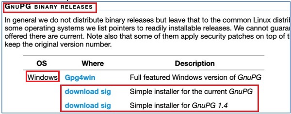
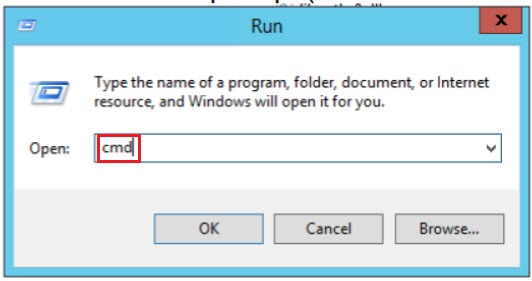
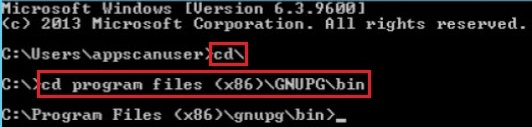
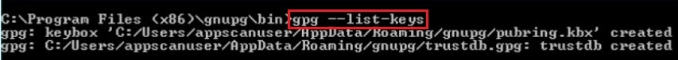
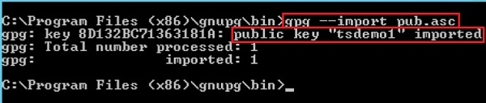
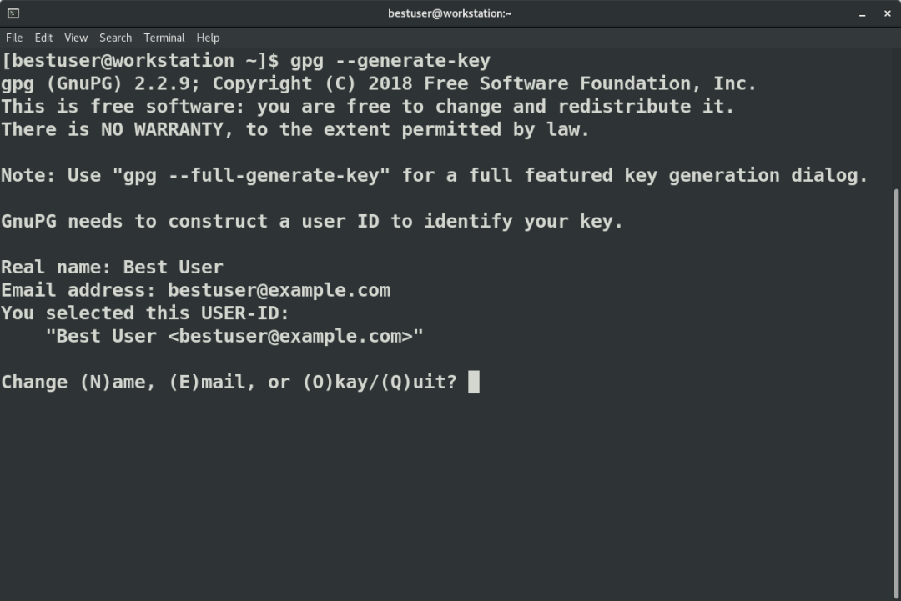
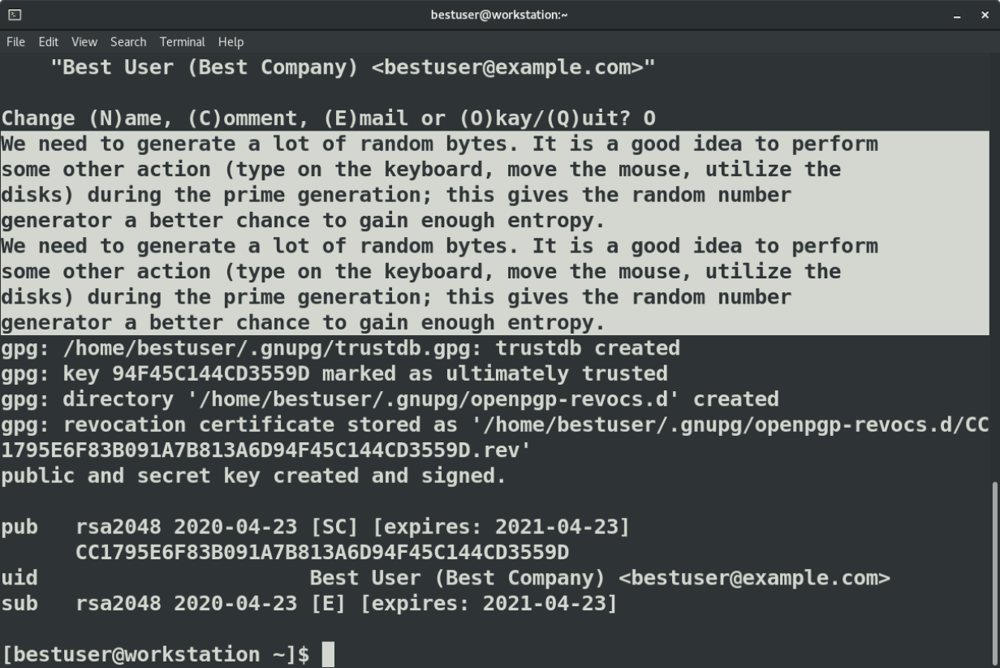
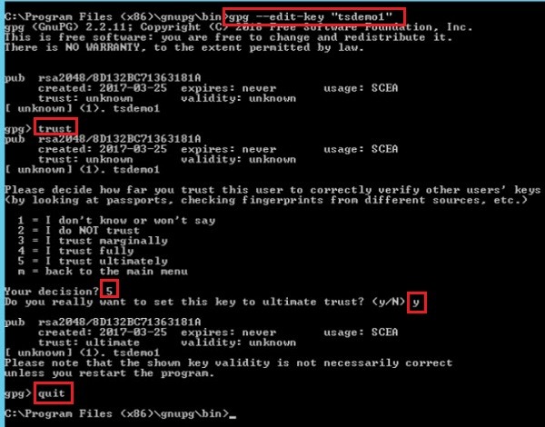
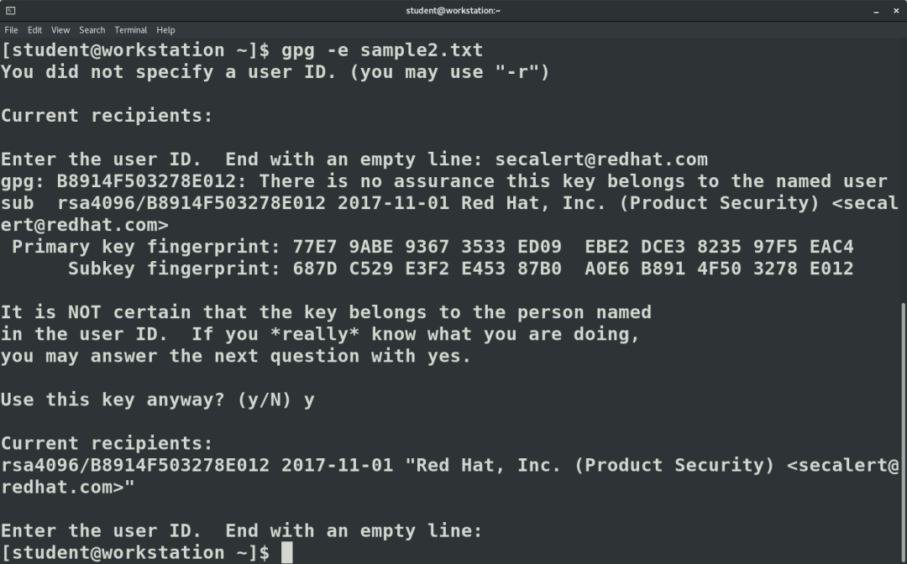

# Using GPG

GnuPG, also known as GPG, can be used to encrypt files for confidentiality or sign files for integrity and authenticity. This article explores the minimum commands needed to encrypt a file or check a signature.

## What is GnuPG and where is it used?

[GnuPG](https://www.gnupg.org/), is a tool that is compliant with the OpenPGP Internet standard described in [RFC4880](https://www.rfc-editor.org/info/rfc4880) and which is used for secure communication and data storage. It has a robust key management system and integrates easily with other applications. In addition to encrypting and signing data, it provides support for S/MIME and Secure Shell (ssh).

Package repositories are mirrored around the world. Digital signatures are used to ensure that you get an exact copy from the original packager and not a malicious version from a compromised site. OpenPGP programs such as GPG are used to sign and verify those packages.

Local disk encryption protects data at rest for your powered-off laptop. However, to make sure that only the intended recipient can open a file you send by email or drop into a shared folder, you need to encrypt that individual file. The TLS certificates used with email or web-based drop boxes only protect the transfer on the wire. OpenPGP products can encrypt a file with a shared symmetric key or with asymmetric key pairs.

## How do I install GnuPG? [^5]
The end result is a PGP-encrypted ZIP file (.zip.pgp) that is ready to be uploaded to the IBM sFTP server.

To do this task, you need the following from the Welcome email: public PGP key (in an .asc file).

### STEP 1 - DOWNLOAD AND INSTALL GNUPG
1. Go to the GnuPG website to [download](https://gnupg.org/download/index.html) the software.
2. Scroll to GnuPG Binary Releases.



3. For the Windows OS, select the Download Sig link either for Simple Installer for the Current GnuPG or Simple Installer for GnuPG 1.4.
4. Select Run and follow the steps to install the software.
5. Open a command prompt (Windows > Run > cmd > OK or Enter key).



6. Enter command `cd\` and press the Enter key to move to the root directory (for example, enter: `C:\`).



7. Change the directory where GNUPG is installed by entering a command like cd Program Files (x86)\gnupg\bin\.
8. Enter gpg --list-keys to initialize and create trustdb (trust database) before first time use.



### STEP 2 - FINISH INSTALL FOR OPERATING SYSTEM

The following shows what you enter in a Command Prompt window for each operating system. This assumes you already went to the GnuPG website and downloaded/installed the software.

In all the operating systems, to check if your software installed correctly, enter gpg --help in the command line.

__MacOS__

1. Install HomeBrew by entering the following in the command line:
/usr/bin/ruby -e "$(curl -fsSL https://raw.githubusercontent.com/Homebrew/install/master/install)"
2. Install GnuPG by entering the following in the command line:
brew install gnupg
3. You may be asked to enter Xcode in the command line if you never installed it.

__Debian / Ubuntu OS (Linux)__ - Install __GnuPG__ by entering the following in the command line:

```
sudo apt-get update -y
sudo apt-get install -y gnupg2
gpg --list-keys --with-keygrip
```

__Redhat / Fedora OS (Linux)__ - Install __GnuPG__ by entering the following in the command line:

```
sudo yum install gnupg2
gpg --list-keys --with-keygrip
```

## Import Public GPG Key. [^5]

1. Download the public PGP key to your machine. An .asc file is used by PGP encryption.
2. Open a command prompt and enter the path to the .asc file so that you can import the key. Note: This is a one time task.

```
gpg --import <complete_path_to_.asc_file>
```

> Example: `gpg --import pub.asc`



>Note: If the public key is successfully imported, the name of the __key__ (a user ID (__uid__ as provided in the Welcome email) displays. In this example, __tsdemo1__ is the __name of the key__. You need the key name for encryption.

3. If you enter `gpg --list-keys` in the command prompt, all available public keys on this particular machine display, including the public key you imported.


4. You can list the fingerprint of the key and compare it to the web site to see if I already have the correct key.

```
$ gpg --fingerprint
/home/gnupg/.gnupg/pubring.kbx
---------------------------------
pub   rsa4096 2017-10-31 [SC]
      77E7 9ABE 9367 3533 ED09  EBE2 DCE3 8235 97F5 EAC4
uid           [ unknown] Red Hat, Inc. (Product Security) <secalert@redhat.com>
sub   rsa4096 2017-11-01 [E]
```

### You can also import keys or subkeys into another GnuPG home directory. 
The example expects you're in your project root directory and 
have a folder etc for stuff like this keyring in there.

```
gpg --homedir ./etc/gnupg --import subkeys.pgp
```

Change the passphrase of the separated subkey.

```
gpg --homedir ./etc/gnupg --edit-key 0xDEADBEEF
```

Instead of using your "normal" keyring, always refer to the separate GnuPG directory as mentioned above.

## Creating a GPG keypair. [^2]

To receive an encrypted file that only you can open, you first need to create a key pair and then share your public key. Creating the key pair is similar to creating ssh keys in that you choose a key size, specify an identifier, and set a passphrase.

The `gpg` command has three options for creating a key pair:

The `--quick-generate-key` option requires you to specify the USER-ID field on the command line and optionally an algorithm, usage, and expire date. It implements defaults for all other options.
The `--generate-key` option prompts for the real name and email fields before asking for a confirmation to proceed. In addition to creating the key, it also stores a revocation certificate.
The `--full-generate-key` option, demonstrated below, provides a dialog for all options.
Image



The `quick` and `full` generate options can also be used in a batch mode as documented in the `man` page.

Let's describe the options on the `full` generate option:

``` bash
$ gpg --full-generate-key
Please select what kind of key you want:
   (1) RSA and RSA (default)
   (2) DSA and Elgamal
   (3) DSA (sign only)
   (4) RSA (sign only)
Your selection?
```

The first question is what kind of key algorithm you want. Defaults are that for a reason. Unless you have a company policy that specifies otherwise, choose the default of RSA and RSA for your multi-use or email exchange key pair.

```
RSA keys may be between 1024 and 4096 bits long.
What keysize do you want? (2048)
```

Next is the key size. Longer is not always better, but I would definitely go with 2048 or 4096. The Fedora and Red Hat security keys we imported in the last article are both 4096 in length.

```
Please specify how long the key should be valid.
         0 = key does not expire
      <n>  = key expires in n days
      <n>w = key expires in n weeks
      <n>m = key expires in n months
      <n>y = key expires in n years
Key is valid for? (0)
```

Check company policies for how long the key should be valid. Then consider your security habits as well. Notice the default is "does not expire." I usually go with years for an email key. For signing keys, I think about the expected lifetime of the objects I am signing. If you don't expire the key, it is never automatically revoked even if the private key is compromised. If you do expire the key, you need a plan to update and rotate keys before the expiration. You are asked to confirm your selection before continuing.

The next set of prompts constructs the identity.

```
GnuPG needs to construct a user ID to identify your key.

Real name: Best User
Email address: bestuser@example.com
Comment: Best Company
You selected this USER-ID:
    "Best User (Best Company) <bestuser@example.com>"

Change (N)ame, (C)omment, (E)mail or (O)kay/(Q)uit?
```

The __Real name__ is the name of a person, company, or product. __Email address__ is the contact email for the key, and the optional __Comment__ can identify a company, use, or version. You can use the `gpg --list-keys` command to view some of the identities for imported keys. Here are a few examples:

```
Red Hat, Inc. (Product Security) <secalert@redhat.com>
Fedora (32) <fedora-32-primary@fedoraproject.org>
Fedora (iot 2019) <fedora-iot-2019@fedoraproject.org>
Fedora EPEL (8) <epel@fedoraproject.org>
Susan Lauber (Lauber System Solutions, Inc.) <sml@laubersolutions.com>
```

After confirming the settings, you are prompted for a passphrase for the private key. The `gpg` command requires an agent for this, so you may find that you need to be logged in directly as the user. If you are on a graphical desktop such as GNOME, the agent may be a graphical pop-up box. Once completed, the key information is displayed on the screen.



Additionally, a lot of random bytes are needed to generate the key. A newly installed virtual machine may not have enough entropy. You can check the available entropy on a system by viewing a proc file:

```
$ cat /proc/sys/kernel/random/entropy_avail
3859
```

If the value is less than 3000, you may need to generate more entropy. Besides the keyboard and mouse activity that is suggested in the output of the `gpg` command, additional entropy sources can be configured with the [rng-tools](https://github.com/nhorman/rng-tools) package. A Red Hat knowledge article explains how to configure [rngd](https://access.redhat.com/articles/1314933) to use the `/dev/urandom` device for additional entropy.

## Editing a GPG key [^5]

Occasionally you need to edit a key. This step ensures you are __ready for encrypting files using this key__. You can change expiration dates and passwords, sign or revoke keys, and add and remove emails and photos.

```
$ gpg --edit-key "tsdemo"
gpg>
```

At the subprompt, help or a ? lists the available edit commands.

### Set trust level on an existing key

```
gpg> trust
Please decide how far you trust this user to correctly verify other users' keys
(by looking at passports, checking fingerprints from different sources, etc.)

  1 = I don't know or won't say
  2 = I do NOT trust
  3 = I trust marginally
  4 = I trust fully
  5 = I trust ultimately
  m = back to the main menu

Your decision? 5
Do you really want to set this key to ultimate trust? (y/N) y

```



### To add an email address, you will actually add a USER-ID value. [^2]

```
gpg> adduid
Real name: Best User
Email address: bestuser@someschool.edu
Comment: Student account
You selected this USER-ID:
    "Best User (Student account) <bestuser@someschool.edu>"

Change (N)ame, (C)omment, (E)mail or (O)kay/(Q)uit? O
```

You can use `list` to show the identities, `uid` to select an identity, and `deluid` to delete an identity. The `quit` command exits the edit utility and prompts you to save your changes.

After adding a new USER-ID, both identities are shown when listing the key.

```
$ gpg --list-keys
gpg: checking the trustdb
gpg: marginals needed: 3  completes needed: 1  trust model: pgp
gpg: depth: 0  valid:   1  signed:   0  trust: 0-, 0q, 0n, 0m, 0f, 1u
gpg: next trustdb check due at 2021-04-23
/home/bestuser/.gnupg/pubring.kbx
---------------------------------
pub   rsa2048 2020-04-23 [SC] [expires: 2021-04-23]
      CC1795E6F83B091A7B813A6D94F45C144CD3559D
uid           [ultimate] Best User (Student account) <bestuser@someschool.edu>
uid           [ultimate] Best User (Best Company) <bestuser@example.com>
sub   rsa2048 2020-04-23 [E] [expires: 2021-04-23]
```

Make sure to save the key changes

```
gpg> save
```

Now that we have multiple UIDs within the same key, it’s important to check that the primary UID is properly set. If not, we have to change it:

```
$ gpg --edit-key 31EFB482E969EB74399DBBC5E881015C8A55678B
gpg (GnuPG) 2.2.14; Copyright (C) 2019 Free Software Foundation, Inc.
This is free software: you are free to change and redistribute it.
There is NO WARRANTY, to the extent permitted by law.

Secret key is available.

sec  rsa4096/E881015C8A55678B
    created: 2019-03-27  expires: never       usage: SC
    trust: ultimate      validity: ultimate
ssb  rsa4096/89BF354A17A61CC5
    created: 2019-03-27  expires: never       usage: E
[ultimate] (1). Daniel Pecos Martinez <dani@dplabs.io>
[ultimate] (2)  Daniel Pecos Martinez <me@danielpecos.com>

gpg> uid 2

sec  rsa4096/E881015C8A55678B
    created: 2019-03-27  expires: never       usage: SC
    trust: ultimate      validity: ultimate
ssb  rsa4096/89BF354A17A61CC5
    created: 2019-03-27  expires: never       usage: E
[ultimate] (1). Daniel Pecos Martinez <dani@dplabs.io>
[ultimate] (2)* Daniel Pecos Martinez <me@danielpecos.com>

gpg> primary

sec  rsa4096/E881015C8A55678B
    created: 2019-03-27  expires: never       usage: SC
    trust: ultimate      validity: ultimate
ssb  rsa4096/89BF354A17A61CC5
    created: 2019-03-27  expires: never       usage: E
[ultimate] (1)  Daniel Pecos Martinez <dani@dplabs.io>
[ultimate] (2)* Daniel Pecos Martinez <me@danielpecos.com>

gpg> save
```

## Create subkeys [^4]

At this moment, we have a key pair generated and containing the UIDs we want to use, and we could be good to go, but, what would happen if we lost the laptop where this key pair is stored? We would have to revoke them and generate a new key pair, loosing all its signatures and the trust gathered with time.

In order to avoid this situation is a common (and good) practice to generate what is known as __laptop keys__. These keys are disposable keys that are linked to your master key and that you would copy to the device where you would use them as usual, keeping the master key safe offline.

If by any eventuality you’d lose access to those __laptop keys__ you could easily revoke them with the master key and generate a new set to replace them, but the master key pair (and thus your PGP/GPG ID) would remain the same.


### What are subkeys?
OpenPGP further supports subkeys, which are like the normal keys, except they're bound to a primary key pair. A subkey can be used for signing or for encryption. The really useful part of subkeys is that they can be revoked independently of the primary keys, and also stored separately from them.

In other words, subkeys are like a separate key pair, but automatically associated with your primary key pair.

GnuPG actually uses a signing-only key as the primary key, and creates an encryption subkey automatically. Without a subkey for encryption, you can't have encrypted e-mails with GnuPG at all. Debian requires you to have the encryption subkey so that certain kinds of things can be e-mailed to you safely, such as the initial password for your debian.org shell account.

### Why?
Subkeys make key management easier. The primary key pair is quite important: it is the best proof of your identity online, at least for Debian, and if you lose it, you'll need to start building your reputation from scratch. If anyone else gets access to your private primary key or its private subkey, they can make everyone believe they're you: they can upload packages in your name, vote in your name, and do pretty much anything else you can do. This can be very harmful for Debian. You might dislike it as well. So you should keep all your private keys safe.

You should keep your private primary key very, very safe. However, keeping all your keys extremely safe is inconvenient: every time you need to sign a new package upload, you need to copy the packages onto suitable portable media, go into your sub-basement, prove to the armed guards that you're you by using several methods of biometric and other identification, go through a deadly maze, feed the guard dogs the right kind of meat, and then finally open the safe, get out the signing laptop, and sign the packages. Then do the reverse to get back up to your Internet connection for uploading the packages.

Subkeys make this easier: you already have an automatically created encryption subkey and you create another subkey for signing, and you keep those on your main computer. You publish the subkeys on the normal keyservers, and everyone else will use them instead of the primary keys for encrypting messages or verifying your message signatures. Likewise, you will use the subkeys for decrypting and signing messages.

You will need to use the primary keys only in exceptional circumstances, namely when you want to modify your own or someone else's key. More specifically, you need the primary private key:

* when you sign someone else's key or revoke an existing signature,
* when you add a new UID or mark an existing UID as primary,
* when you create a new subkey,
* when you revoke an existing UID or subkey,
* when you change the preferences (e.g., with setpref) on a UID,
* when you change the expiration date on your primary key or any of its subkey, or
* when you revoke or generate a revocation certificate for the complete key.

(Because each of these operation is done by adding a new self- or revocation signatures from the private primary key.)

Since each link of the Web of Trust is an endorsement of the binding between a public key and a user ID, OpenPGP certification signatures (from the signer's private primary key) are relative to a UID and are irrelevant for subkeys. In particular, subkey creation or revocation does not affect the reputation of the primary key. So in case your subkey gets stolen while your primary key remains safe, you can revoke the compromised subkey and replace it with a new subkey without having to rebuild your reputation and without reducing reputation of other people's keys signed with your primary key.

### How?
Unfortunately, GnuPG's user interface is not entirely fun to use. We'll take you through the necessary steps below.

These instructions assume you use one computer, and keep the primary keys on an encrypted USB flash drive, or preferably at least two (you should keep backups of your secret keys). We also assume you already have a key; if not, see http://keyring.debian.org/creating-key.html for instructions.

1. Make backups of your existing GnuPG files ($HOME/.gnupg). Keep them safe. If something goes wrong during the following steps, you may need this to return to a known good place.

```
umask 077; tar -cf $HOME/gnupg-backup.tar -C $HOME .gnupg
```

(note: umask 077 will result in restrictive permissions for the backup.)

2. Create a new subkey for signing.
Find your key ID: `gpg --list-keys yourname`

```
gpg --edit-key YOURPRIMARYKEYID
gpg> addkey
```

* This asks for your passphrase, type it in.
  * Choose the "RSA (sign only)" key type.
  * It would be wise to choose 4096 (or at least 2048) bit key size.
  * Choose an expiry date (you can rotate your subkeys more frequently than the primary keys, or keep them for the life of the primary key, with no expiry).
  * Julian calendars can help calculate the exact number of days to a target calendar date
  * `date +%j` # command line to display current Julian date
  * `date -d 2021-05-16 +%j` # command to display specific Julian date
* GnuPG will (eventually) create a key, but you may have to wait for it to get enough entropy to do so.
* Save the key: `save`

3. You can repeat this, and create an "RSA (encrypt only)" subkey as well, if you like or if you need to. As mentioned above, keep in mind that the default option when initially creating a new keypair is to create an encryption subkey, so you probably have one already. In any case, for Debian, just the signing key is sufficient.
4. Now copy `$HOME/.gnupg` to your USB drives.
5. Here comes the tricky part: you need to remove the private primary key.
    * If you are using GnuPG 2.1 or later, all you have to do is to delete the file `$HOME/.gnupg/private-keys-v1.d/KEYGRIP.key`, where KEYGRIP is the "keygrip" of the primary key which can be found by running `gpg2 --with-keygrip --list-key YOURPRIMARYKEYID`. (The private part of each key pair has a keygrip, hence this command lists one keygrip for the primary key and one for each subkey.) Note however that if the keyring has just been migrated to the new format, then the now obsolete $HOME/.gnupg/secring.gpg file might still contain the private primary key: thus be sure to delete that file too if it is not empty.
    * Unfortunately GnuPG <2.1 does not provide a convenient way to do remove the private primary key. Instead, we need to export the subkey, remove the private key, and import the subkey back.
      * Export the subkeys: `gpg --output secret-subkeys --export-secret-subkeys YOURPRIMARYKEYID`. Alternatively, specify the subkey IDs each followed with an exclamation mark to choose which subkeys to export: `gpg --output secret-subkeys --export-secret-subkeys SUBKEYID! [SUBKEYID! ..]`
      * Remove your primary secret key: `gpg --delete-secret-keys YOURPRIMARYKEYID`
      * Import the subkeys back: `gpg --import secret-subkeys`
      * Remove the file containing the private subkeys: `rm secret-subkeys`
    * Verify that `gpg -K` shows a sec# instead of just sec for your private key. That means the secret key is not really there. (See also the presence of a dummy OpenPGP packet in the output of `gpg --export-secret-keys YOURPRIMARYKEYID | gpg --list-packets`.)
    * Change the passphrase protecting the subkeys: `gpg --edit-key YOURPRIMARYKEYID passwd`. This way if your everyday passphrase is compromised, the private primary key will remain safe from someone with access to the backup: the private key material on the backup, including the private primary key, are protected by the old passphrase.
6. Change the passphrase protecting the subkeys: `gpg --edit-key YOURPRIMARYKEYID passwd`. This way if your everyday passphrase is compromised, the private primary key will remain safe from someone with access to the backup: the private key material on the backup, including the private primary key, are protected by the old passphrase.


```
$ gpg --edit-key 31EFB482E969EB74399DBBC5E881015C8A55678B
gpg (GnuPG) 2.2.14; Copyright (C) 2019 Free Software Foundation, Inc.
This is free software: you are free to change and redistribute it.
There is NO WARRANTY, to the extent permitted by law.

Secret key is available.

sec  rsa4096/E881015C8A55678B
    created: 2019-03-27  expires: never       usage: SC
    trust: ultimate      validity: ultimate
ssb  rsa4096/89BF354A17A61CC5
    created: 2019-03-27  expires: never       usage: E
[ultimate] (1). Daniel Pecos Martinez <me@danielpecos.com>
[ultimate] (2)  Daniel Pecos Martinez <dani@dplabs.io>

gpg> addkey
Please select what kind of key you want:
  (3) DSA (sign only)
  (4) RSA (sign only)
  (5) Elgamal (encrypt only)
  (6) RSA (encrypt only)
Your selection? 4
RSA keys may be between 1024 and 4096 bits long.
What keysize do you want? (2048) 4096
Requested keysize is 4096 bits
Please specify how long the key should be valid.
        0 = key does not expire
      <n>  = key expires in n days
      <n>w = key expires in n weeks
      <n>m = key expires in n months
      <n>y = key expires in n years
Key is valid for? (0) 5y
Key expires at Mon Mar 25 15:42:11 2024 CET
Is this correct? (y/N) y
Really create? (y/N) y
We need to generate a lot of random bytes. It is a good idea to perform
some other action (type on the keyboard, move the mouse, utilize the
disks) during the prime generation; this gives the random number
generator a better chance to gain enough entropy.

sec  rsa4096/E881015C8A55678B
    created: 2019-03-27  expires: never       usage: SC
    trust: ultimate      validity: ultimate
ssb  rsa4096/89BF354A17A61CC5
    created: 2019-03-27  expires: never       usage: E
ssb  rsa4096/665E29633F97EF11
    created: 2019-03-27  expires: 2024-03-25  usage: S
[ultimate] (1). Daniel Pecos Martinez <me@danielpecos.com>
[ultimate] (2)  Daniel Pecos Martinez <dani@dplabs.io>

gpg> save
```

## Encrypt and decrypt a file with a shared secret. [^5]

1. Navigate to the path where the ZIP file you intend to encrypt is located.

2. Enter the following in the command prompt to identify the key (tsdemo1 in this example), and the ZIP file name. -u indicates you are using a key, and -e indicates a ZIP file name follows.

```
gpg -u "<key_uid>" -e <zip_file_to_be_encrypted>
```

> Example: `gpg -u "tsdemo1" -e testfile.zip`


3. Use the -e or --encrypt option to encrypt a file. If you do not specify the recipient on the command line with the -r or --recipient option, you are prompted to specify the user ID. The email address is often the easiest way to specify the user ID.

```
$ gpg -e -r secalert@redhat.com sample2.txt
```

You are shown the key ID and fingerprint, and you may be asked to confirm the usage of the key if the gpg utility cannot verify any signatures on the key.



```
$ file bar*
sample2.txt:     ASCII text
sample2.txt.gpg: PGP RSA encrypted session key - keyid: 504F91B8 12E07832 RSA (Encrypt or Sign) 4096b .
```

## Check a signature. [^1]

Sometimes it is not the confidentiality of the message or file that is an issue, but rather the authenticity. An email or a package file can be digitally signed with a private key and later verified with the public key. Fedora provides CHECKSUM files to verify downloads and signs those files with the Fedora GPG key, as documented on their [security page](https://getfedora.org/security/).

After importing the GPG key, I can check the signature of the CHECKSUM file using the `-v` or `--verify` option.

```
$ gpg -v Fedora-Workstation-31-1.9-x86_64-CHECKSUM
gpg: Signature made Fri 25 Oct 2019 09:09:48 AM EDT
gpg:                using RSA key 50CB390B3C3359C4
gpg: Good signature from "Fedora (31) <fedora-31-primary@fedoraproject.org>" [unknown]
gpg: WARNING: This key is not certified with a trusted signature!
gpg:          There is no indication that the signature belongs to the owner.
Primary key fingerprint: 7D22 D586 7F2A 4236 474B  F7B8 50CB 390B 3C33 59C4
```

The message indicates a "Good signature" but warns that gpg cannot validate the key used for the signature. If I trust the fingerprint provided and the source of the key, then I can trust the file contents are what Fedora released, even if I obtained the CHECKSUM file from an unknown mirror site.

## Exporting GPG Keys

### 1. Exporting the public key to share with others. [^2]

For others to send you encrypted messages that can only be decrypted with your private key, you must first share your public key. Use the `--export` option to export the key from the keyring to a file. In most cases, you will want to make sure the key file does not contain any binary characters so it can be displayed on a web page. The `-a` or `--armor` option encodes the output to plain text. The `-o` or `--output` option saves the output to a specified file instead of displaying it to standard out on the screen.

```
$ gpg --export --armor --output bestuser-gpg.pub
```

To allow other people a method of verifying the public key, also share the fingerprint of the public key in email signatures and even on business cards. The more places it appears, the more likely others will have a copy of the correct fingerprint to use for verification.

```
$ gpg --fingerprint
```

Publishing your exported GPG public key and fingerprint on your web site is a simple way to share the key. The key can also be shared on public keyservers, which also work with email program plugins.

### 2. Exporting the private / primary key for backup. [^3]

A PGP public key contains information about one's email address. This is generally acceptable since the public key is used to encrypt email to your address. However, in some cases, this is undesirable.

For most use cases, __the secret key__ need not be exported and __should not be distributed__. If the purpose is to create a backup key, you should use the backup option:

```
$ gpg --output backupkeys.pgp --armor --export-secret-keys --export-options export-backup user@email
```

TThis will export all necessary information to restore the secrets keys including the trust database information. Make sure you store any backup secret keys off the computing platform and in a secure physical location.

If this key is important to you, I recommend printing out the key on paper using [paperkey](https://www.jabberwocky.com/software/paperkey/). And placing the paper key in a fireproof/waterproof safe.

### Public Key Servers

In general, it's not advisable to post personal public keys to key servers. There is no method of removing a key once it's posted and there is no method of ensuring that the key on the server was placed there by the supposed owner of the key.

It is much better to place your public key on a website that you own or control. Some people recommend keybase.io for distribution. However, that method tracks participation in various social and technical communities which may not be desirable for some use cases.

For the technically adept, I personally recommend trying out the [webkey](https://www.gnupg.org/blog/20160830-web-key-service.html) domain level key discovery service.

[^1]: https://www.redhat.com/sysadmin/getting-started-gpg
[^2]: https://www.redhat.com/sysadmin/creating-gpg-keypairs
[^3]: https://unix.stackexchange.com/questions/481939/how-to-export-a-gpg-private-key-and-public-key-to-a-file
[^4]: https://wiki.debian.org/Subkeys
[^5]: https://www.ibm.com/docs/en/tms-and-wt/version-missing?topic=keys-example-using-gnupg-encrypt-files-pgp-key
