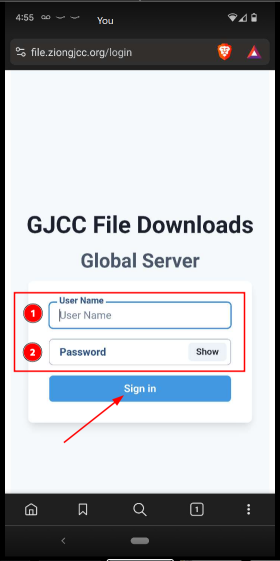
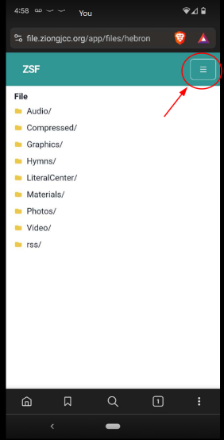
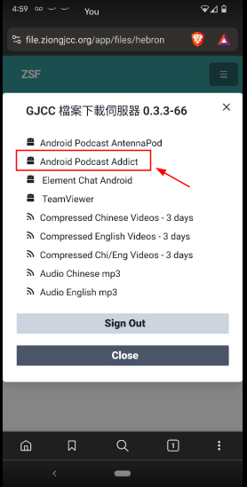
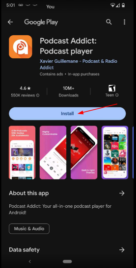
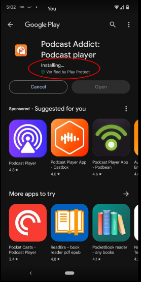
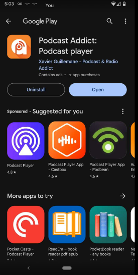
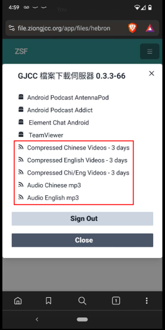
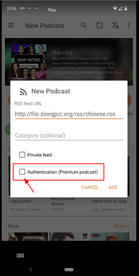
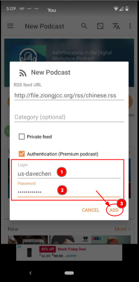
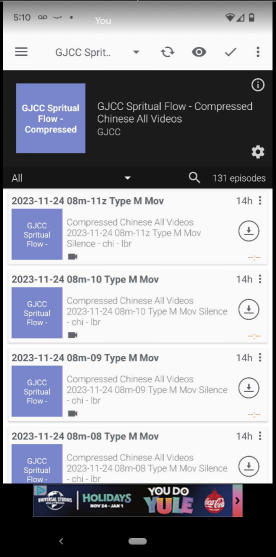

# Podcasts for the Android phones -- Podcast Addict

> ### Podcast Addict
> https://play.google.com/store/apps/details?id=com.bambuna.podcastaddict&hl=en_US&gl=US

> ### GJCC File Server
> [GJCC File Server](https://file.ziongjcc.org)

## 1. Install Podcast Addict

* ### A. Using your browser goto the File Server and Login

> ## https://file.ziongjcc.org

* ### B. Click the menu button

* ### C. Select the Podcast Addict Link

* ### D. Install Podcast Addict

## 2. Subscribe to a RSS Channel

* ### A. Using your browser goto the File Server and Login

> https://file.ziongjcc.org

* ### B. Click the menu button

* ### C. Select one of the RSS Feed Links

* ### C. Subscribe to the selected feed

