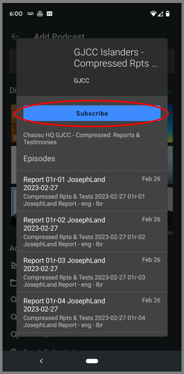
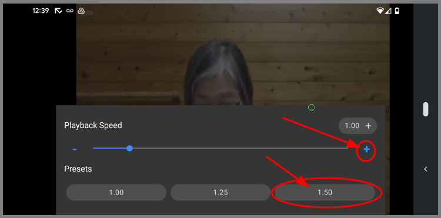

# Podcasts for the Android phones -- Antenna Pod

3. 
    * A. 
    * B. 
    * C. 
    * D. 
    * E. 
    * F. 
    * G. 
    * H. 
    * I. 

## 1. Copy Podcast URL

* ### A. Press and ___Hold___ the url link from Skype

* ### B. Copy podcast url from Skype

## 2. Install Antenna Pod

* ### A. Open Google PlayStore

* ### B. Install Antenna Pod

## 3. AntennaPod App Subscribe Podcast

* ### A. Find and Launch AntennaPod App

* ### B. Add Podcast Menu

* ### C. Add Podcast Main Page

* ### D. Add Podcast By RSS Address

* ### E. Add Podcast By RSS Address

* ### F. Add Podcast By RSS Address

* ### G. Login to Podcast Feed

* ### H. Subscribe to Podcast

## 4. AntennaPod Download and Play Episode

* ### A. Select a Podcast

* ### B. Select and Download an Episode

* ### C. Play an Episode

* ### D. Video Player - And Exit

## 4. AntennaPod Download and Play Episode

* ### A. Select a Podcast

* ### B. Select and Download an Episode

* ### C. Play an Episode

* ### D. Video Player - And Exit

## 5. Stream Podcast Video

* ### A. Select an Episode

* ### B. Stream an Episode

* ### C. Video Player - And Exit

## 6. Change Playback Speed

* ### A. Player Menu

* ### B. Playback Speed - Drag the bottom menu up

* ### C. Select Playback Speed

* ### D. Select Playback Speed And Exit by clicking anywhere on the video

