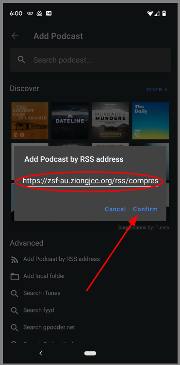

# Podcasts for the Android phones -- Antenna Pod

> ### RSS Feeds
> rss://file-us.ziongjcc.org/rss/chinese.rss

> ### Https RSS Feeds
> [Https RSS Feed](https://file-us.ziongjcc.org/rss/chinese.rss)

1. [Copy Podcast URL](#1-copy-podcast-url)
    * A. [Press and ___Hold___ the url link from Skype](#a-press-and-hold-the-url-link-from-skype)
    * B. [Copy podcast url from Skype](#b-copy-podcast-url-from-skype)
3. [Install Antenna Pod](#2-install-antenna-pod)
    * A. [Open Google PlayStore](#a-open-google-playstore)
    * B. [Install Antenna Pod](#b-install-antenna-pod)
3. [AntennaPod App Subscribe Podcast](#3-antennapod-app-subscribe-podcast)
    * A. [Find and Launch AntennaPod App](#a-find-and-launch-antennapod-app)
    * B. [Add Podcast Menu](#b-add-podcast-menu)
    * C. [Add Podcast Main Page](#c-add-podcast-main-page)
    * D. [Add Podcast By RSS Address](#d-add-podcast-by-rss-address)
    * E. [Enter Podcast By RSS Address](#e-enter-podcast-by-rss-address)
    * F. [Login to Podcast Feed](#f-login-to-podcast-feed)
    * G. [Subscribe to Podcast](#g-subscribe-to-podcast)
4. [AntennaPod Download and Play Episode](#4-antennapod-download-and-play-episode)
    * A. [Select a Podcast](#a-select-a-podcast)
    * B. [Select and Download an Episode](#b-select-and-download-an-episode)
    * C. [Play an Episode](#c-play-an-episode)
    * D. [Video Player - And Exit](#d-video-player---and-exit)
5. [Stream Podcast Video](#5-stream-podcast-video)
    * A. [Select an Episode](#a-select-a-podcast)
    * B. [Stream an Episode](#b-stream-an-episode)
    * C. [Video Player - And Exit](#c-video-player---and-exit)
6. [Change Playback Speed](#6-change-playback-speed)
    * A. [Player Menu](#a-player-menu)
    * B. [Playback Speed - Drag the bottom menu up](#b-playback-speed---drag-the-bottom-menu-up)
    * C. [Select Playback Speed](#c-select-playback-speed)
    * D. [Select Playback Speed And Exit by clicking anywhere on the video](#d-select-playback-speed-and-exit-by-clicking-anywhere-on-the-video)

## 1. Copy Podcast URL

* ### A. Press and ___Hold___ the url link from Skype

* ### B. Copy podcast url from Skype

## 2. Install Antenna Pod

* ### A. Open Google PlayStore

* ### B. Install Antenna Pod

## 3. AntennaPod App Subscribe Podcast

* ### A. Find and Launch AntennaPod App

* ### B. Add Podcast Menu

* ### C. Add Podcast Main Page

* ### D. Add Podcast By RSS Address

* ### E. Enter Podcast By RSS Address

* ### F. Login to Podcast Feed

* ### G. Subscribe to Podcast

## 4. AntennaPod Download and Play Episode

* ### A. Select a Podcast

* ### B. Select and Download an Episode

* ### C. Play an Episode

* ### D. Video Player - And Exit

## 5. Stream Podcast Video

* ### A. Select an Episode

* ### B. Stream an Episode

* ### C. Video Player - And Exit

## 6. Change Playback Speed

* ### A. Player Menu

* ### B. Playback Speed - Drag the bottom menu up

* ### C. Select Playback Speed

* ### D. Select Playback Speed And Exit by clicking anywhere on the video

