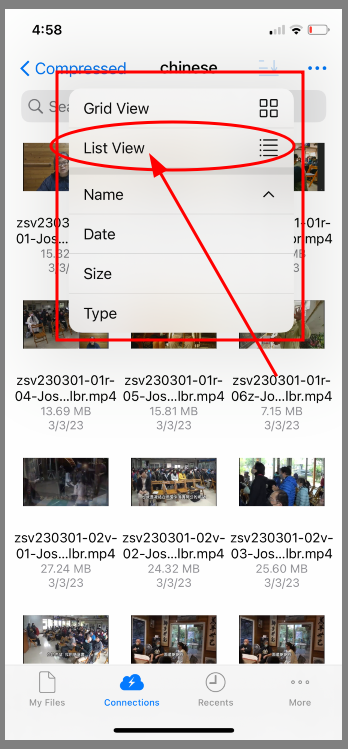
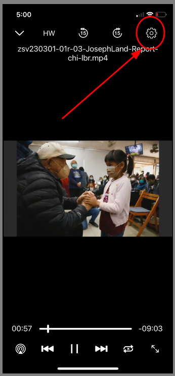

# Podcasts for the IPhone -- Owl Files

1. [Copy Webdav URL](#1-copy-webdav-url)
    * A. [Press and ___Hold___ the url link from Messages or Skype](#a-press-and-hold-the-url-link-from-messages-or-skype)
    * B. [Copy podcast url from Messages or Skype](#b-copy-podcast-url-from-messages-or-skype)
2. [Install Owlfiles from the App Store](#2-install-owlfiles-from-the-app-store)
    * A. [Go to the App Store](#a-go-to-the-app-store)
    * B. [Select Owlfiles in the results drop down](#b-select-owlfiles-in-the-results-drop-down)
    * C. [Click the GET Button](#c-click-the-get-button)
3. [Add Connection](#3-add-connection)
    * A. [Launch Owlfiles App](#a-launch-owlfiles-app)
    * B. [Select Default Options](#b-select-default-options)
    * C. [Add Connection](#3-add-connection)
    * D. [Enter WebDav Information](#d-enter-webdav-information)
    * E. [Enter WebDav Credentials](#e-enter-webdav-credentials)
4. [Select WebDav Connection](#4-select-webdav-connection)
    * A. [Select WebDav Connection](#a-select-webdav-connection)
    * B. [Select WebDav Folder](#b-select-webdav-folder)
    * C. [Change View Mode - Details](#c-change-view-mode---details)
5. [Download and Watch Videos](#5-download-and-watch-videos)
    * A. [Select the File you want to download](#a-select-the-file-you-want-to-download)
    * B. [Play File and Exit](#b-play-file-and-exit)
6. [Playback Speed](#6-playback-speed)
    * A. [Click on Player Setting Icon](#a-click-on-player-setting-icon)
    * B. [Select Payback Speed](#b-select-payback-speed)

## 1. Copy Webdav URL

* ### A. Press and ___Hold___ the url link from Messages or Skype

* ### B. Copy podcast url from Messages or Skype

## 2. Install Owlfiles from the App Store

* ### A. Go to the App Store

* ### B. Select Owlfiles in the results drop down

* ### C. Click the GET Button

## 3. Add Connection

* ### A. Launch Owlfiles App

* ### B. Select Default Options

* ### C. Add Connection

* ### D. Enter WebDav Information

* ### E. Enter WebDav Credentials

## 4. Select WebDav Connection

* ### A. Select WebDav Connection

* ### B. Select WebDav Folder

* ### C. Change View Mode - Details

## 5. Download and Watch Videos

* ### A. Select the file you want to download

* ### B. Play File and Exit

## 6. Playback Speed

* ### A. Click on Player Setting Icon

* ### B. Select Payback Speed

