# Podcasts for the IPhone -- RSSRadio

1. [Copy Podcast URL](#1-copy-podcast-url)
    * A. [Press and ___Hold___ the url link from Messages or Skype](#a-press-and-hold-the-url-link-from-messages-or-skype)
    * B. [Copy podcast url from Messages or Skype](#b-copy-podcast-url-from-messages-or-skype)
2. [Install RSS Radio from the app store](#2-install-rss-radio-from-the-app-store)
    * A. 
    * B. 
    * C. 
3. [Subscribe to Podcast](#3-subscribe-to-podcast)
    * A. [Launch RSS Radio App](#a-launch-rss-radio-app)
    * B. 
    * C. 
    * D. 
    * E. 
    * F. 
    * G. 
    * H. 
    * I. 
4. [Download and Watch Videos](#4-download-and-watch-videos)
    * A. [Select Podcast](#a-select-podcast)
    * B. 
    * C. 
    * D. 

## 1. Copy Podcast URL

* ### A. Press and ___Hold___ the url link from Messages or Skype

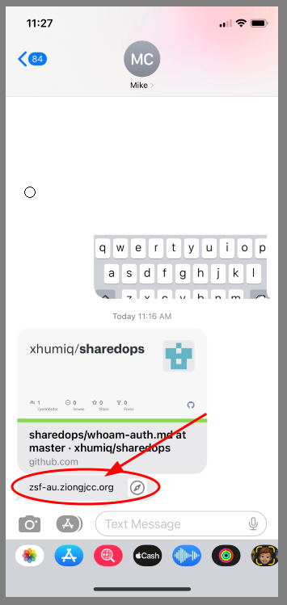
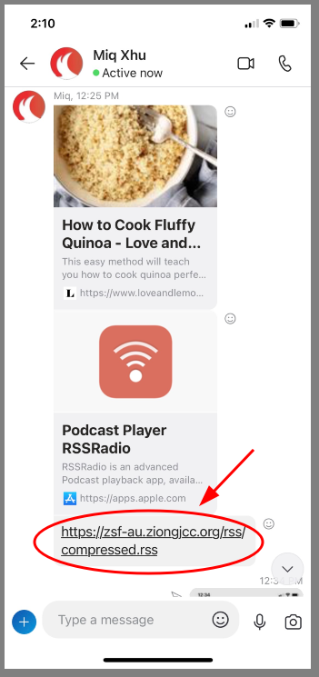

* ### B. Copy podcast url from Messages or Skype

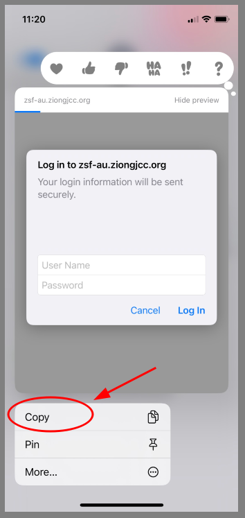
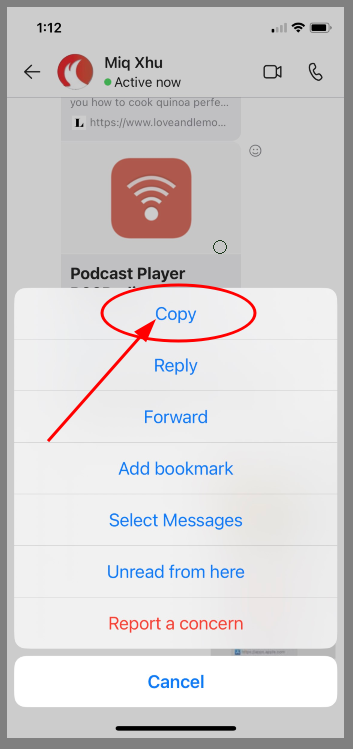

## 2. Install RSS Radio from the app store

* ### A. Go to the App Store
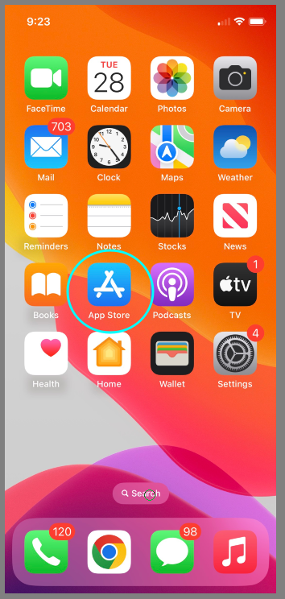
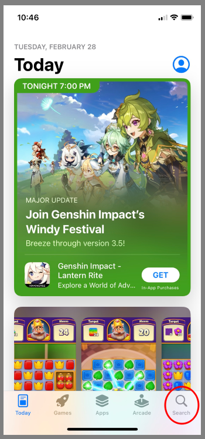

* ### B. Select RSS Radio in the results drop down

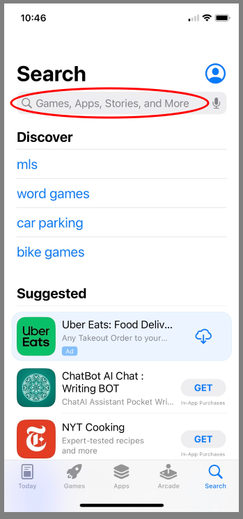
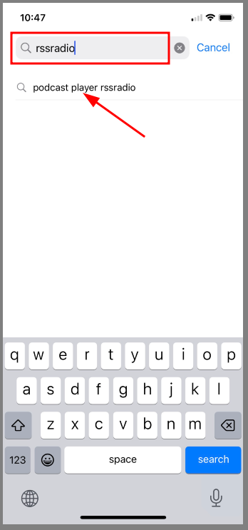

* ### C. Click the Download Button
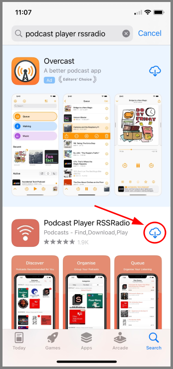
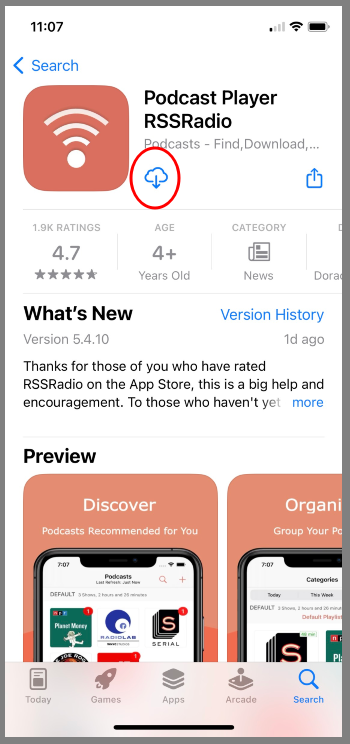

## 3. Subscribe to Podcast

* ### A. Launch RSS Radio App
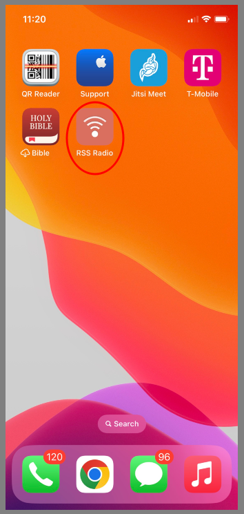
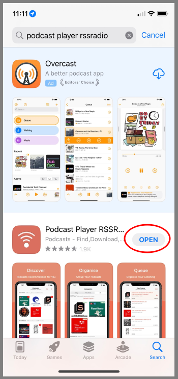
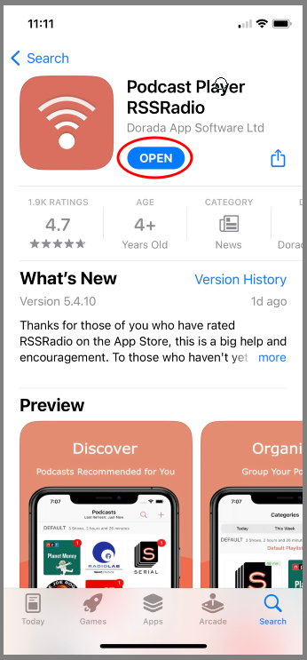

* ### B. Select Default Options
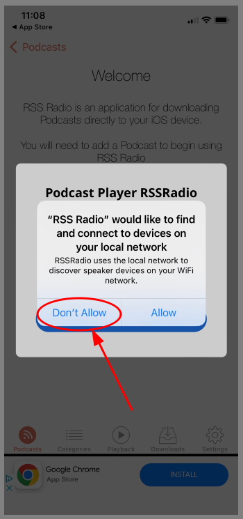
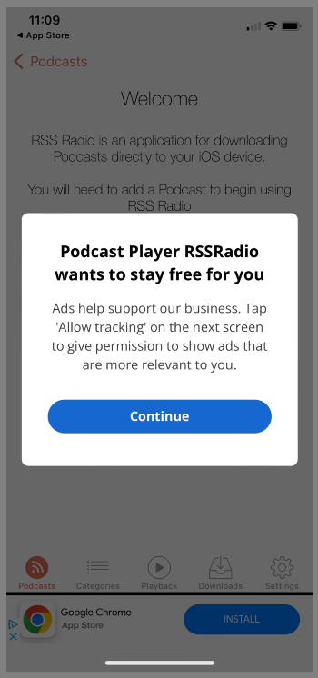
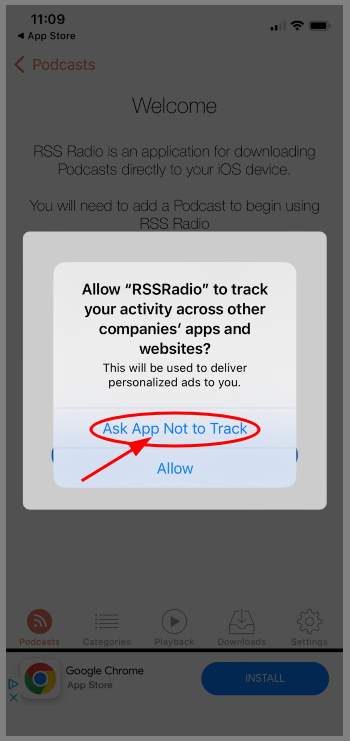

* ### C. Add Podcast
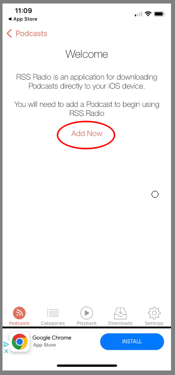
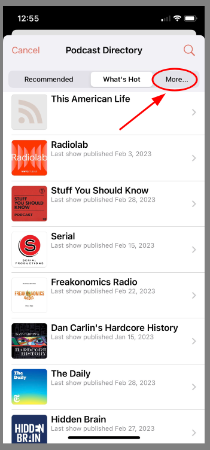
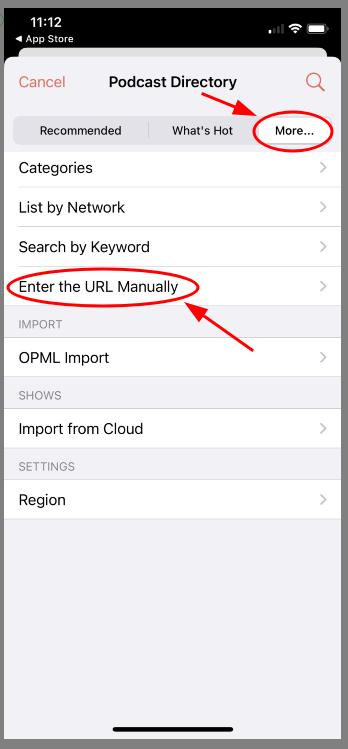

* ### D. Enter Podcast Url
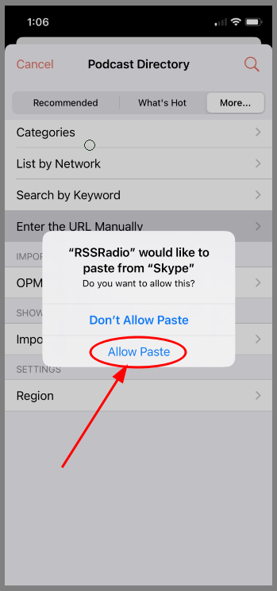
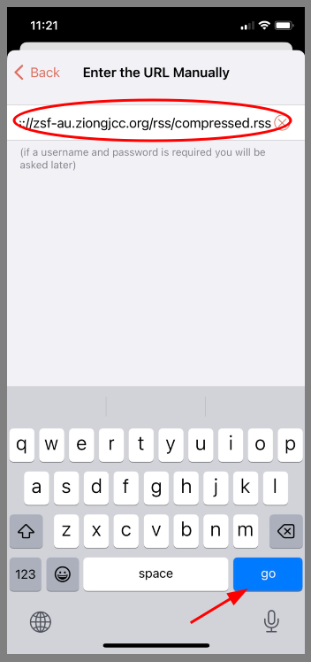
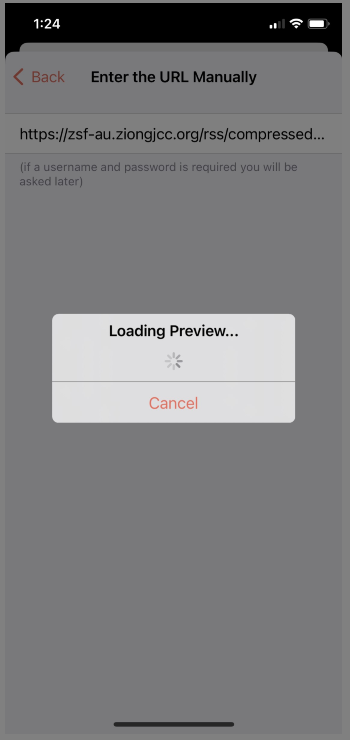

* ### E. Enter Podcast Credentials
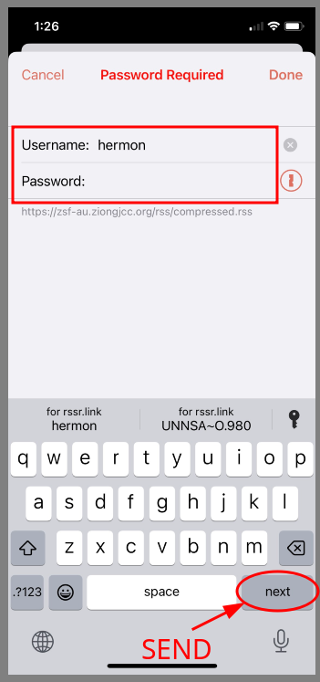

* ### F. Subscribe to Podcast
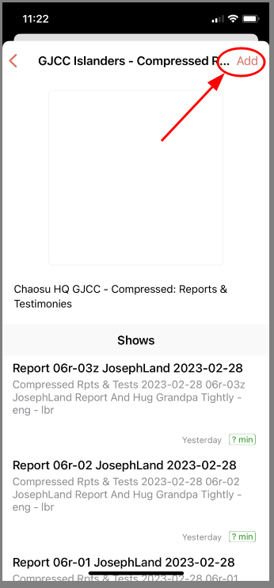

* ### G. You may not see this prompt, but if you do...
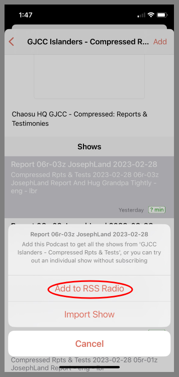

* ### H. Podcast Settings
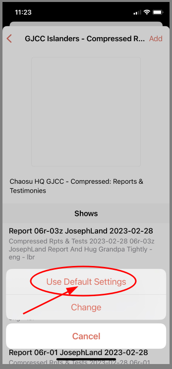
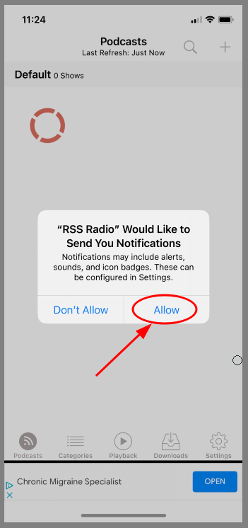

* ### I. Optional - Help and Tips
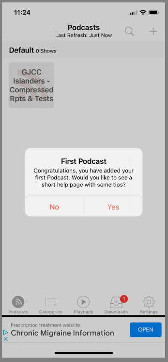

## 4. Download and Watch Videos

* ### A. Select Podcast
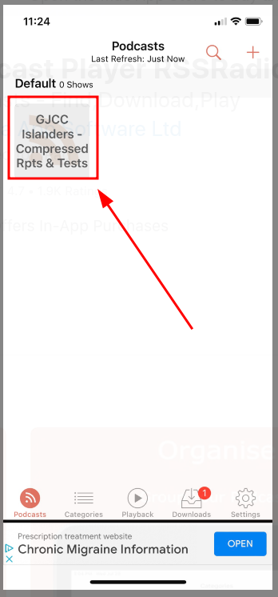
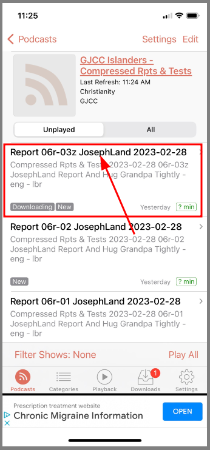

* ### B. Select Episode for Playback
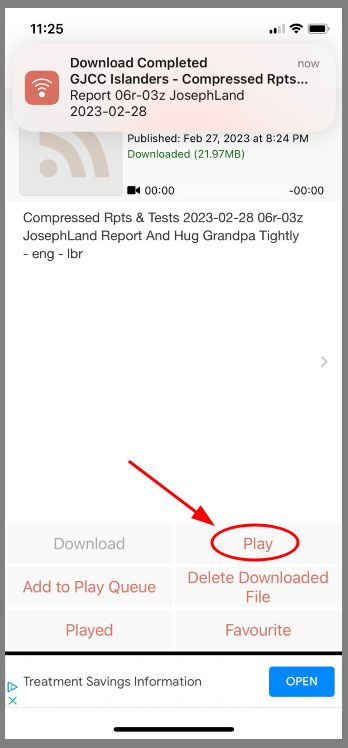
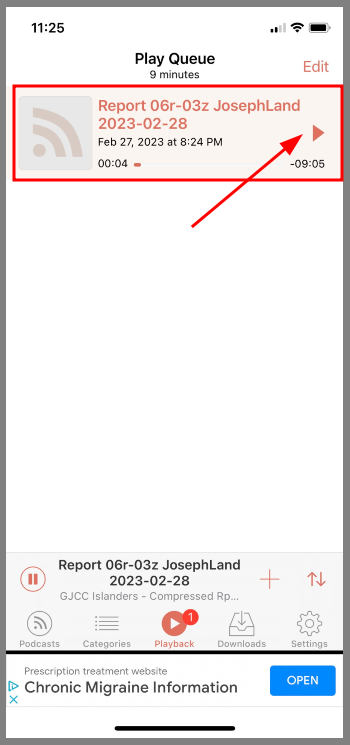

* ### C. If you see bufferring - wait for it to complete
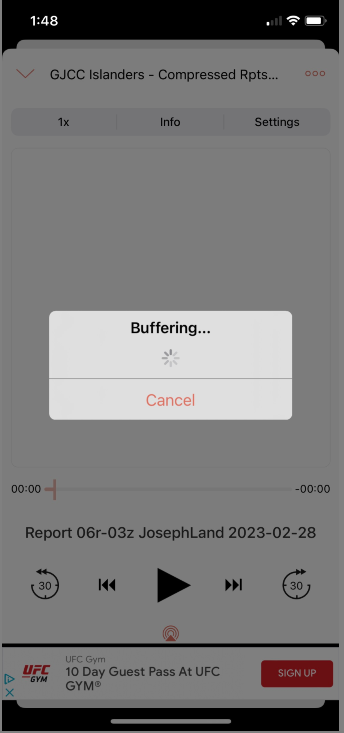

* ### D. View Player and Exit Player
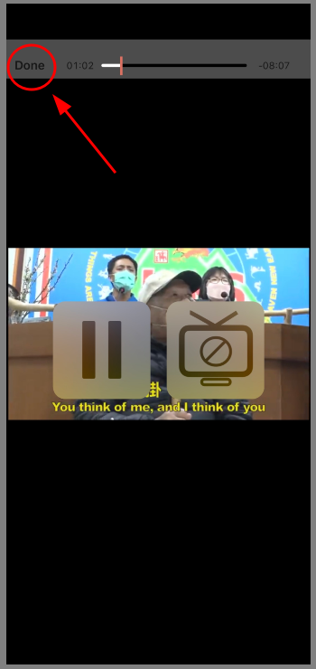

