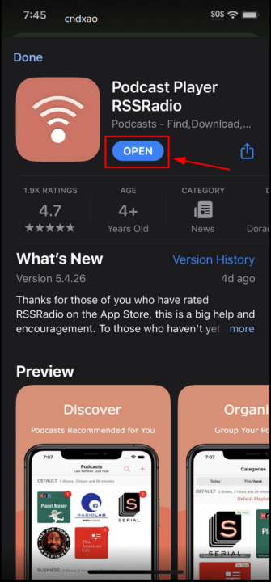
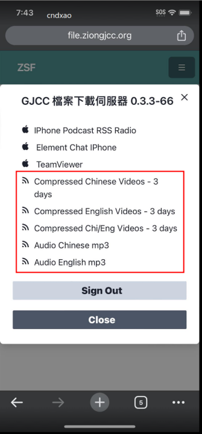
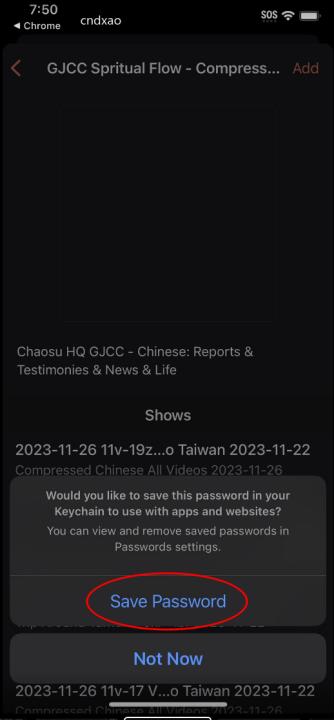

# Podcasts for the IPhone -- RSSRadio

1. [Copy Podcast URL](#1-copy-podcast-url)
    * A. [Press and ___Hold___ the url link from Messages or Skype](#a-press-and-hold-the-url-link-from-messages-or-skype)
    * B. [Copy podcast url from Messages or Skype](#b-copy-podcast-url-from-messages-or-skype)
2. [Install RSS Radio from the app store](#2-install-rss-radio-from-the-app-store)
    * A. [Go to the App Store](#a-go-to-the-app-store)
    * B. [Select RSS Radio in the results drop down](#b-select-rss-radio-in-the-results-drop-down)
    * C. [Click the Download Button](#c-click-the-download-button)
3. [Subscribe to Podcast](#3-subscribe-to-podcast)
    * A. [Launch RSS Radio App](#a-launch-rss-radio-app)
    * B. [Select Default Options](#b-select-default-options)
    * C. [Add Podcast](#c-add-podcast)
    * D. [Enter Podcast Url](#d-enter-podcast-url)
    * E. [Enter Podcast Credentials](#e-enter-podcast-credentials)
    * F. [Subscribe to Podcast](#f-subscribe-to-podcast)
    * G. [You may not see this prompt, but if you do...](#g-you-may-not-see-this-prompt-but-if-you-do)
    * H. [Podcast Settings](#h-podcast-settings)
    * I. [Optional - Help and Tips](#i-optional---help-and-tips)
4. [Download and Watch Videos](#4-download-and-watch-videos)
    * A. [Select Podcast](#a-select-podcast)
    * B. [Select Episode for Playback](#b-select-episode-for-playback)
    * C. [If you see bufferring - wait for it to complete](#c-if-you-see-bufferring---wait-for-it-to-complete)
    * D. [View Player and Exit Player](#d-view-player-and-exit-player)

## 1. Install RSS Radio

* ### A. Using your browser goto the File Server and Login

> ## https://file.ziongjcc.org

* ### B. Click the menu button

* ### C. Select the Podcast Addict Link

* ### D. Install Podcast Addict

* ### E. Return to Browser File Server

## 2. Subscribe to a RSS Channel

* ### A. Using your browser goto the File Server and Login
You may skip the login if you have already logged into the file server.

> ## https://file.ziongjcc.org

* ### B. Click the menu button

* ### C. Select one of the RSS Feed Links

* ### D. Login to subscribe channel

* ### D. Allow network access but deny tracking

* ### D. Save Password

* ### D. Add Subscription

* ### D. Allow Notifications

* ### D. RSSRadio Help Documentation
You may wish to see the documenation. If you do - click "YES"

* ### D. Start Playing Files!

