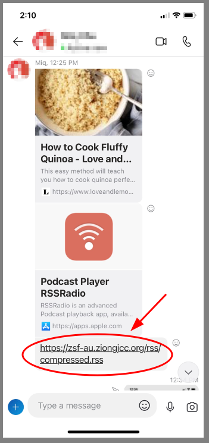
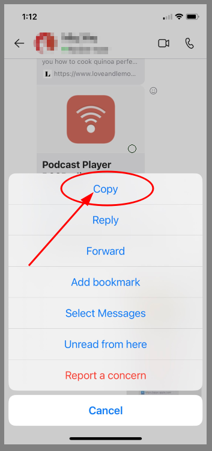
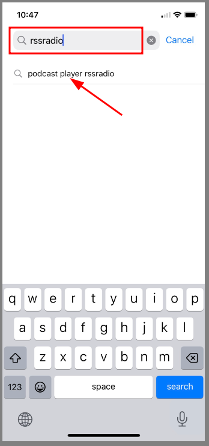
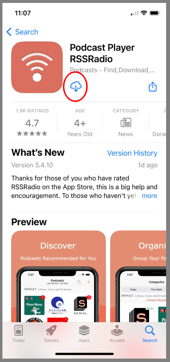
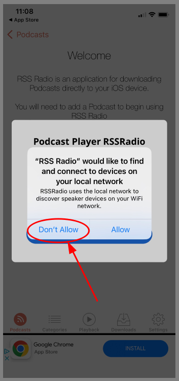
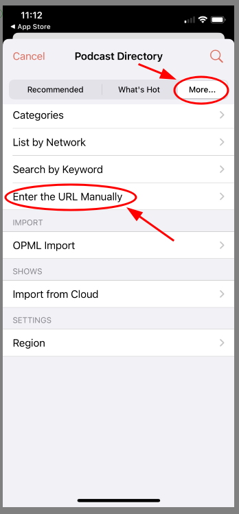
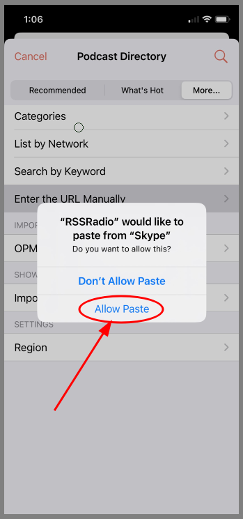
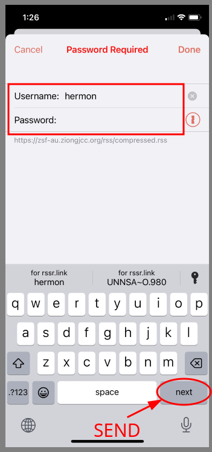

# Podcasts for the IPhone -- RSSRadio

1. [Copy Podcast URL](#1-copy-podcast-url)
    * A. [Press and ___Hold___ the url link from Messages or Skype](#a-press-and-hold-the-url-link-from-messages-or-skype)
    * B. [Copy podcast url from Messages or Skype](#b-copy-podcast-url-from-messages-or-skype)
2. [Install RSS Radio from the app store](#2-install-rss-radio-from-the-app-store)
    * A. [Go to the App Store](#a-go-to-the-app-store)
    * B. [Select RSS Radio in the results drop down](#b-select-rss-radio-in-the-results-drop-down)
    * C. [Click the Download Button](#c-click-the-download-button)
3. [Subscribe to Podcast](#3-subscribe-to-podcast)
    * A. [Launch RSS Radio App](#a-launch-rss-radio-app)
    * B. [Select Default Options](#b-select-default-options)
    * C. [Add Podcast](#c-add-podcast)
    * D. [Enter Podcast Url](#d-enter-podcast-url)
    * E. [Enter Podcast Credentials](#e-enter-podcast-credentials)
    * F. [Subscribe to Podcast](#f-subscribe-to-podcast)
    * G. [You may not see this prompt, but if you do...](#g-you-may-not-see-this-prompt-but-if-you-do)
    * H. [Podcast Settings](#h-podcast-settings)
    * I. [Optional - Help and Tips](#i-optional---help-and-tips)
4. [Download and Watch Videos](#4-download-and-watch-videos)
    * A. [Select Podcast](#a-select-podcast)
    * B. [Select Episode for Playback](#b-select-episode-for-playback)
    * C. [If you see bufferring - wait for it to complete](#c-if-you-see-bufferring---wait-for-it-to-complete)
    * D. [View Player and Exit Player](#d-view-player-and-exit-player)

## 1. Login to File Server

* ### A. Using Browser on your IPhone - go to File.Ziongjcc.org

* ### B. Copy podcast url from Messages or Skype

## 2. Install RSS Radio from the app store

* ### A. Go to the App Store

* ### B. Select RSS Radio in the results drop down

* ### C. Click the Download Button

## 3. Subscribe to Podcast

* ### A. Launch RSS Radio App

* ### B. Select Default Options

* ### C. Add Podcast

* ### D. Enter Podcast Url

* ### E. Enter Podcast Credentials

* ### F. Subscribe to Podcast

* ### G. You may not see this prompt, but if you do...

* ### H. Podcast Settings

* ### I. Optional - Help and Tips

## 4. Download and Watch Videos

* ### A. Select Podcast

* ### B. Select Episode for Playback

* ### C. If you see bufferring - wait for it to complete

* ### D. View Player and Exit Player

