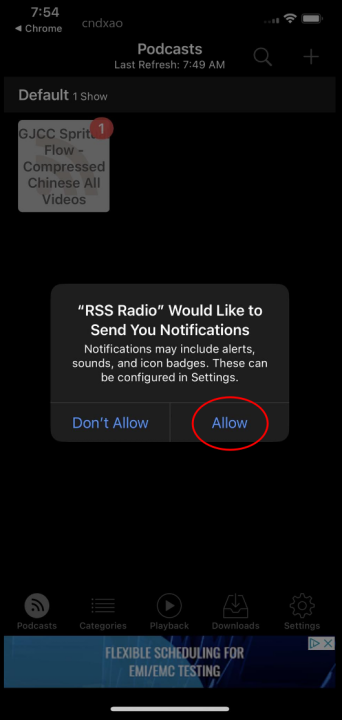

# Podcasts for the IPhone -- RSSRadio

## 1. Install RSS Radio

* ### A. Using your browser goto the File Server and Login

> ## https://file.ziongjcc.org

* ### B. Click the menu button

* ### C. Select the Podcast Addict Link

* ### D. Install Podcast Addict

* ### E. Return to Browser File Server

## 2. Subscribe to a RSS Channel

* ### A. Using your browser goto the File Server and Login
You may skip the login if you have already logged into the file server.

> ## https://file.ziongjcc.org

* ### B. Click the menu button

* ### C. Select one of the RSS Feed Links

* ### D. Login to subscribe channel

* ### D. Allow network access but deny tracking

* ### D. Save Password

* ### D. Add Subscription

* ### D. Allow Notifications

* ### D. RSSRadio Help Documentation
You may wish to see the documenation. If you do - click "YES"

* ### D. Start Playing Files!

