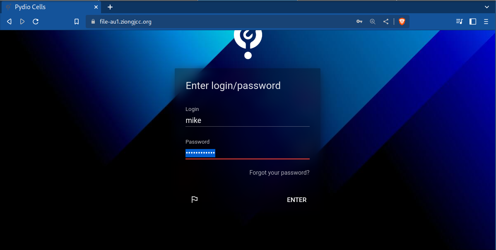
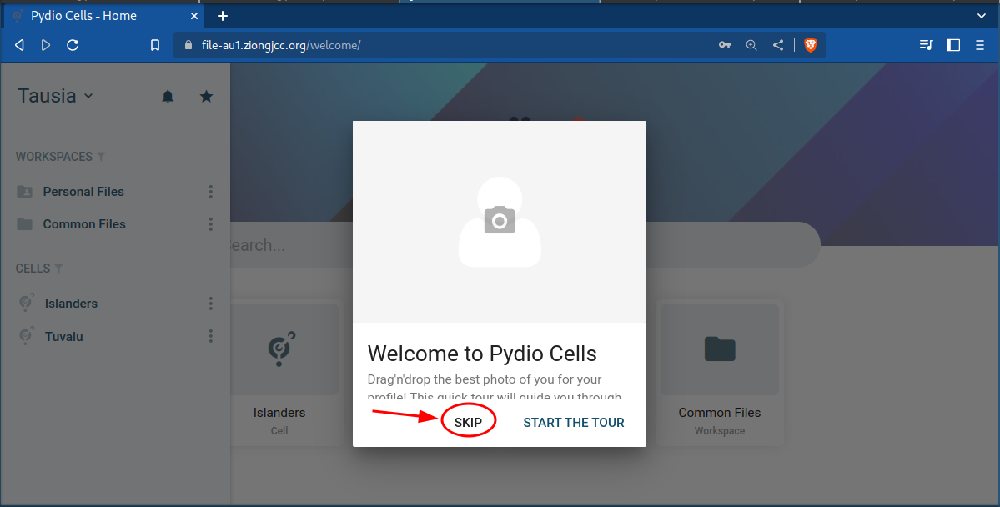
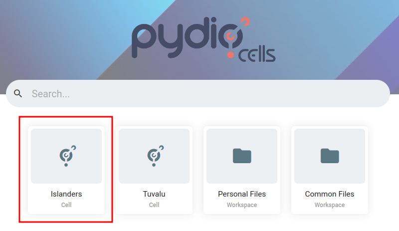
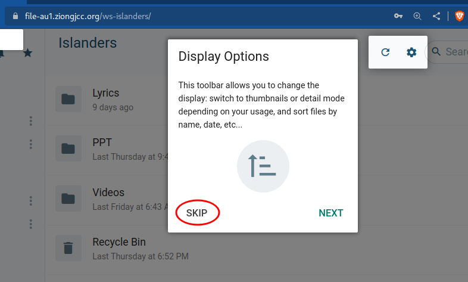
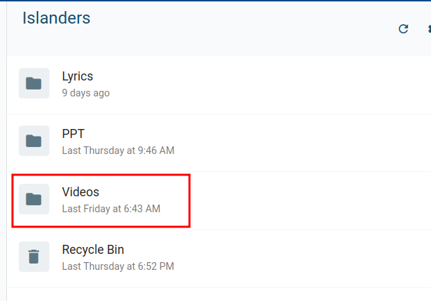
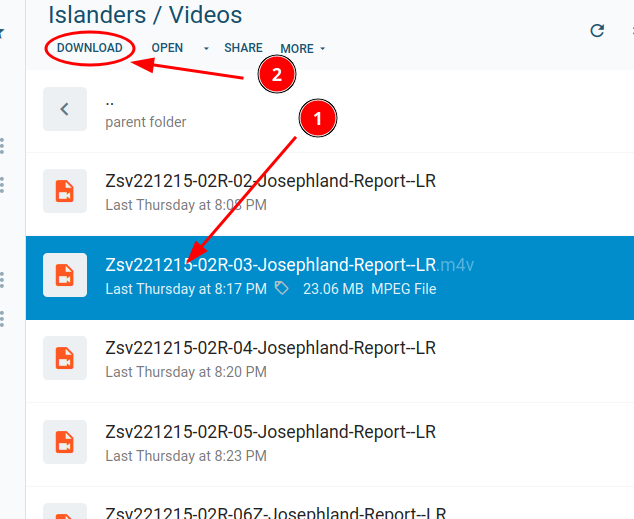
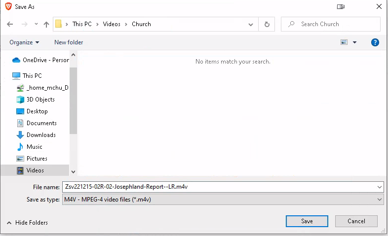

# How to download files

## Login into Pydio

> Open the file sharing site via browser - Brave, Firefox or Chrome

1. Start with a browser and go to pydio: https://file-au1.ziongjcc.org/

2. You may see a box that gives you the option to tour the file sharing web site. You can skip the tour to start downloading files.

3. You will see the home page links - choose the Islander Cell for shared videos.

4. Pydio may again give you an option to tour the features of Pydio Cells. You may skip the tour to start downloading files.

5. In the Islanders cell, find the __Videos__ folder to download the current videos.

6. In the __Videos__ folder - select a file to download and click on the __DOWNLOAD__ button.

    ### To Download file

    1. Select File
    2. Click Download

7. Save File to Local Drive

