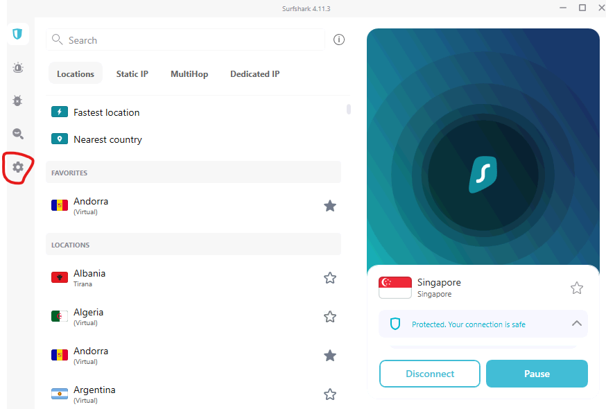
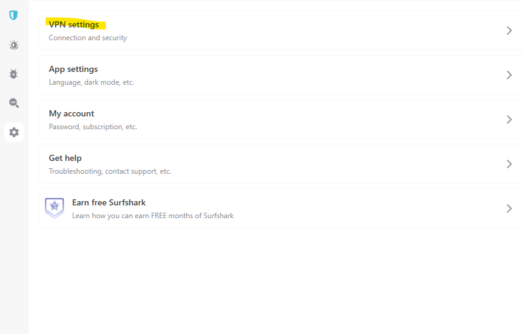
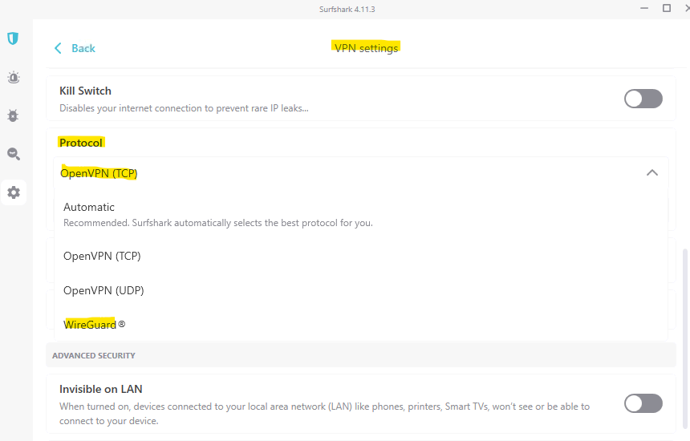

# Connectivity issues with Surf Shark

## How to change Wireguard transport to OpenVPN

1. Start Surf Shark Application from the Windows Start Menu.
2. Click on the settings icon to bring up the settings page.

3. Select VPN settings from the menu on the Settings Page.

> ### For more information on SurfSharks network protocols - see here.
> https://support.surfshark.com/hc/en-us/articles/360010324739-What-protocols-can-I-use-with-Surfshark-

3. Select the OpenVPN (TCP) option on the VPN Settings Page.

