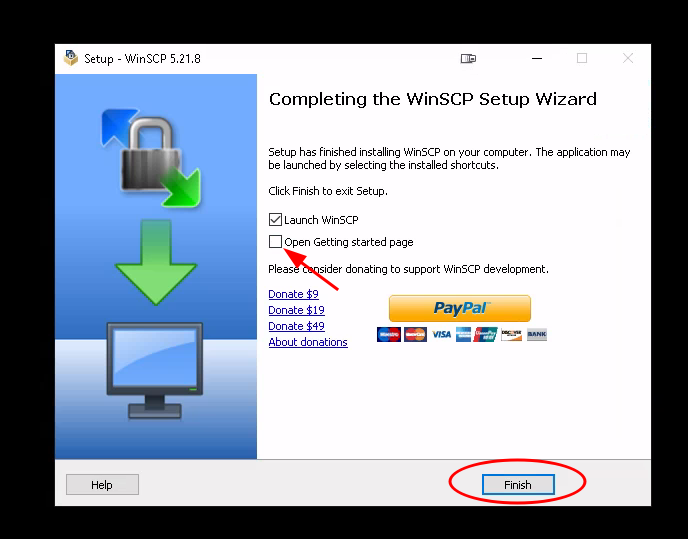
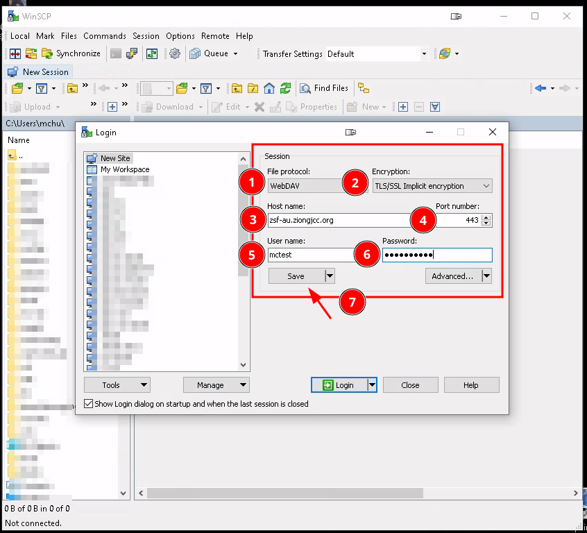
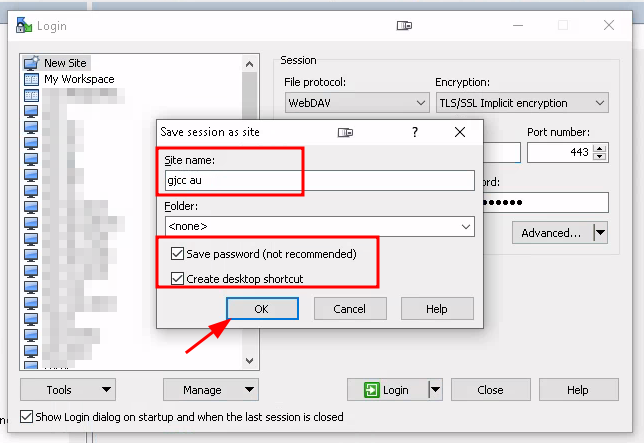

# Winscp User Guide

> ### Direct Link to Download Install File:
> https://winscp.net/download/WinSCP-5.21.8-Setup.exe

> ### Official Instructions of Insalling Winscp
> https://winscp.net/eng/docs/installation

## Download and Install Winscp

### 1. Start with a browser and go to the winscp download page: https://winscp.net/eng/downloads.php

    You can obtain WinSCP from the WinSCP download page. 
    You should save the installer to an easily accessible location such as your Microsoft Windows desktop or your My Documents folder.

### 2. Double click on the downloaded Installation File

    1. If you have WinSCP running, close it. The installer will not run if it finds any instance of WinSCP running.
    2. Open the installation program by double-clicking on its icon.
    3. The WinSCP installer starts. Follow its instructions.

### 3. Allow the Install App to make changes to your device.

### 4. Accept the licensing agreement.

### 5. You may keep the Full Upgrade options and move to the `Next` step.

### 6. Install the Winscp Application

### 7. Wait for the installation to complete

### 8. Complete the download.

    You may skip the `Getting Started Page` by unchecking the box.

> ### Official Guide to Winscp Site Settings
> https://winscp.net/eng/docs/ui_login

> ### Winscp guide to security and connectivity
> https://winscp.net/eng/docs/protocols

## Connect to your regional GJCC File Server

### 1. Create a new `Site` Connection

    Enter the following information to your Winscp `NewSite` Form:

| Item | Value |
|---|---|
| File Protocol | WebDAV |
| Encryption | TLS/SSL Implicit Encryption |
| Host Name | zsf-au1.ziongjcc.org |
| Port Number | 443 |
| User Name | << Use the user name U Hermon will provide for you >> |
| Password | << Use the password U Hermon will provide for you >> |

### 2. Save the password with your new site connection.

    Click the checkbox next to the `Save password` so you won't need to type the password again on future connections.

> ### Official Guide to Winscp Explorer Interface
> https://winscp.net/eng/docs/ui_explorer

> ### Official Guide to Winscp Basic Tasks
> https://winscp.net/eng/docs/task_index

## Login and Download GJCC Files

### 1. Login to site (Your site name may be different)

    Click the site that was previously saved

### 2. Select the compressed folder

    The compressed folder contains video files that are rendered to be as small as possible for fast downloads.

### 2. Select the language you want

    Regular video files contains both the chinese and english languages.
    Compressed files only contain the preferred language selected.

### 3. Select the files you want to download and drag them to your explorer window.

    Use your mouse to drag and drop selected files.

